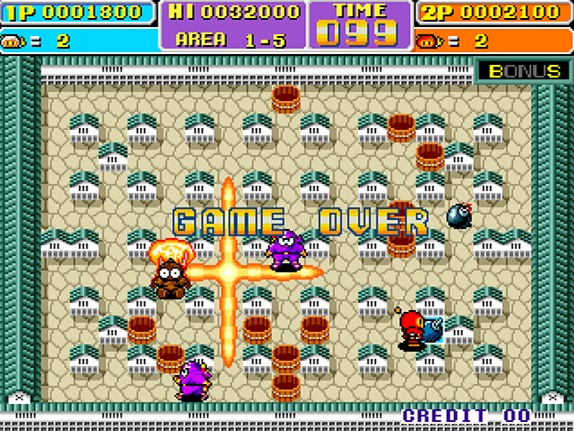

=(Irem90_Senhor notes)=-

Tested: Working Video 720p, 1080p & Sound

# Irem M90 Core

MiSTer FPGA core for the [Irem M90](https://www.system16.com/hardware.php?id=746), [M97 and M99](https://www.system16.com/hardware.php?id=748) arcade system. This system is most commonly known for Bomber Man and Bomber Man World, which are also call some variation of "Dyna Blaster" or "Atomic Punk" in some regions. It is a single board system based around an NEC V35 main CPU, a single graphics IC called a GA25 and a Z80/YM2151 based sound system. The V35 is a microcontroller version of the V30 used on the M72 boards. It contains a built in interupt controller which is used by these games. It also contains other features such as timers and DMA controllers, which are not used. The audio hardware is almost identical to the hardware found on M72 and M84 systems. The GA25 manages both sprites and tilemaps. It supports two tilemap layers and up to 84 sprites. Row scrolling and row selection is supported.

## Supported Games
|Name|Region|Notes|
|---|---|---|
|[Bomber Man](https://en.wikipedia.org/wiki/Bomberman)|Japan, US, World|Also known as _Dyna Blaster_ in Europe and _Atomic Punk_ in the US.|
|[Bomber Man World](https://en.wikipedia.org/wiki/Bomber_Man_World)|Japan|Also known as _New Dyna Blaster - Global Quest_ in Europe and _New Atomic Punk - Global Quest_ in the US.|

## Currently Unsupported Games
|Name|Notes|
|---|---|
|Risky Challenge / Gussun Oyoyo|Graphical issues.|
|Hasamu|Uses alternative video timing.|
|Quiz F1 1-2 Finish|Bank switching.|
|Match It II/Shisensho II|Uses alternative video timing.|

## Thanks
Many people, knowingly or not, contributed to this work.
- @SmokeMonsterTWI for lending me his M90 board which was used for all timing measurements and GA25 analysis.
- @jotego for the YM2151 implementation.
- @sorgelig for developing and maintaining MiSTer
- The MiSTer FPGA discord server for the helpful advice and support
